# xihu0325_9103_tut6
# 1.Imaging Technique Inspiration

# 1.1 Source of inspiration
Dandelions, chimneys, and fires all have one thing in common: change and flow. Dandelion seeds are scattered in the wind, smoke from the chimney is floating in the air, and the fire is constantly burning and dancing. This common characteristic inspired the idea of this programming project.

```mermaid
sequenceDiagram
Chimney ->>Dandelion: White, floating in the air
Torch-->>Dandelion:Dissipate using point shapes
Dandelion--x Torch: Still living
Dandelion-x Chimney: Alive
Note right of Torch: Circle <br/>disappear<br/>burst into life<br/>Need an objects.
Dandelion-->Chimney: Dispersed，consume
Chimney->Torch:inanimate
```

## 1.2 Technology

Through coding, I wanted to create a dynamic cylindrical device that could constantly change size and release patterns according to the melody and rhythm of the music, like dandelion seeds blowing in the wind, smoke from a chimney flowing through the air, and flames constantly pulsating. I hope that my programming project can combine the flow characteristics of these natural elements with the innovation of technology to create a unique art installation, through which the audience can experience the perfect integration of music, technology, and nature in a unique way.

# 2.Coding Technique Exploration
Reasonable use of p5.js library, audio analysis, understanding of 3D graphics rendering, add interactivity, enhance visual effects.

## 2.1 Implementation technology

Set a "button" to control audio playback with function, and add a "web" to turn on 3D rendering mode with "WEBGL". The amplitude data of the music was obtained with ".ffT "waveform.  Draw the same cylinder with "translate" and function, switch to 3D view with "orbit control", change the cylinder direction with "rotates", and set the total height of the cylinder with "map" and "waveform".  Particle code was added, particle disappearance was set with "splice", and "random" and "waveform" were combined to make particles release different numbers of particles along with the intensity of the music.
## 2.2 Flow chart

## 2.3 Screenshots and links

https://github.com/xihu0325/xihu0325/blob/main/sketch.js
